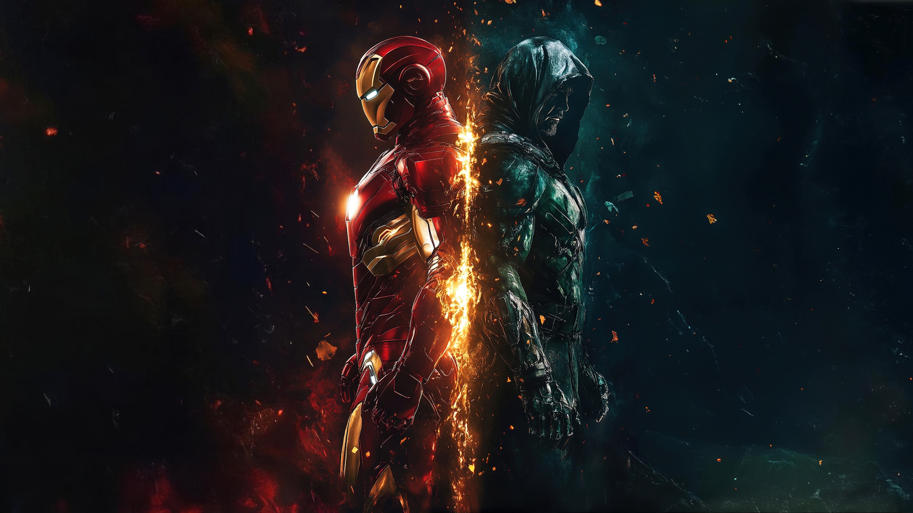

<!DOCTYPE html>
<html lang="en">
<head>
    <meta charset="UTF-8">    
    <meta name="viewport" content="width=device-width, initial-scale=1.0">
    <link rel="icon" href="naughty.png" type="image/x-icon">
    <link rel="stylesheet" href="style.css"/>
    
    <title>VeeleLog</title>
</head>
<body>
 <nav class="navbar"> 
    

        
VeeleLog😜

        <input type="text" class="search" placeholder="Search"/>
        

            
            
            
            
            
              
        

    

</nav>
<nav class="navbar-mobile-top">
    

        
        <input type="text" class="search" placeholder="Search"/>
        

            
            
            
        

    

</nav> 
<nav class="navbar-mobile-bottom">
    

        

            
            
            
            
             
        

    

</nav>
<section class="main">
    

        

            

                <button class="story--scroll" id="scroll-left" onclick="scrollHorizantal(1)"><i class="fas fa-chevron-left"></i></button>
                <button class="story--scroll" id="scroll-right" onclick="scrollHorizantal(-1)"><i class="fas fa-chevron-right"></i></button>
                

                    

                        

                            
                        

                        
Sanjiban Panda

                    

                    

                        

                            
                        

                        
Shahrukh Khan

                    

                    

                        

                            
                        

                        
Connor The Fighter

                    

                    

                        

                            
                        

                        
Salmon Bhai

                    

                    

                        

                            
                        

                        
Pankaj Tripathi

                    

                    

                        

                            
                        

                        
Khabib Fighter

                    

                    

                        

                            
                        

                        
Tom Hardy

                    

                    

                        

                            
                        

                        
Geeksforgeeks

                    

                

            

            

                

                    

                        

                            
                        

                        
Shahrukh Khan

                    

                     
                

                
                

                    

                        
                        
                        
                        
                    

                    
Liked by <b>Shahrukh Khan</b>and<b>12222 others</b>

                    

                        Aryan Khan: *OMG DADDY!!!!
                    

                    
View all 45 comments

                    
2 days ago

                

                

                    
                    <input type="text" class="comment-box" placeholder="Add a comment.."/>
                    <button class="comment-btn">Post</button>
                

            

            

                

                    

                        

                            
                        

                        
Tom-Hiddleston

                    

                    
                

                
                

                    
 
                        
                        
                        
                        
                    

                    
4,5637 likes

                    

                        Tom-Hiddleston:Verified which of these pins remind you of your bfff(best birb friend forver)? 
                        Tag that below! Psst: you can get these Friendship enabled pins from Tom Hiddleston friend shop link in bio
                    

                    
View all 283 comments

                    
23 days ago

                

                

                    
                    <input type="text" class="comment-box" placeholder="Add a comment..."/>
                    <button class="comment-btn">Post</button>
                

            

            

                

                    

                        

                            
                        

                        
Lion

                    

                    
                

                
                

                    

                        
                        
                        
                        
                    

                    
4,345 likes

                    

                        Lion:Verified which of these pins remind you of your bfff(best birb friend forver)? 
                        Tag that below! Psst: you can get these Friendship enabled pins from Lion friend shop link in bio
                    

                    
View All the Comments

                    
7 days ago

                

                

                    
                    <input type="text" class="comment-box" placeholder="Add a comment....."/>
                    <button class="comment-btn">Post</button>
                

            

            

                

                    

                        

                            
                        

                        
Iron Man

                    

                    
                

                
                

                    

                        
                        
                        
                        
                    

                    
19,345 likes

                    

                        Iron Man:Verified which of these pins remind you of your bfff(best birb friend forver)? 
                        Tag that below! Psst: you can get these Friendship enabled pins Iron Man friend shop link in bio
                    

                    
View All the Comments

                    
6 days ago

                

                

                    
                    <input type="text" class="comment-box" placeholder="Add a comment....."/>
                    <button class="comment-btn">Post</button>
                

            

        

        

            

                

                    
                

                

                    
RaushanTheGoat

                    
Raushan Kumar

                    
Bio: Nothing much

                

                

                    <button class="action-btn">Switch</button>
                

            

            

                

                    
Suggestion for You

                

                

                    <button class="seeall-btn">See All</button>
                

            

            

                

                    
                

                

                    
Robert Downey Jr

                    
New to Instagram

                

                

                    <button class="action-btn">follow</button>
                

            

            

                

                    
                

                

                    
VisuallyWise

                    
New to Instagram

                

                

                    <button class="action-btn">Follow</button>
                

            

            

                

                    
                

                

                    
vertasium

                    
Suggested For you

                

                

                    <button class="action-btn">Follow</button>
                

            

            

                

                    
                

                

                    
JustAnotherUser

                    
Suggested For you

                

                

                    <button class="action-btn">Follow</button>
                

            

            

                

                    
                

                

                    
lifeisdn

                    
Suggested For you

                

                

                    <button class="action-btn">Follow</button>
                

            

            

                

                    
                

                

                    
blablahbahl

                    
Suggested For you

                

                

                    <button class="action-btn">Follow</button>
                

            

            

                
About

                
Help

                
Press

                
API

                
Jobs

                
Privacy

                
Terms and Conditions

            

            

                
Locations

                
Language

            

            

                
@Mygram from Raushan

            

        

    

    
</section>
</body>
</html>
